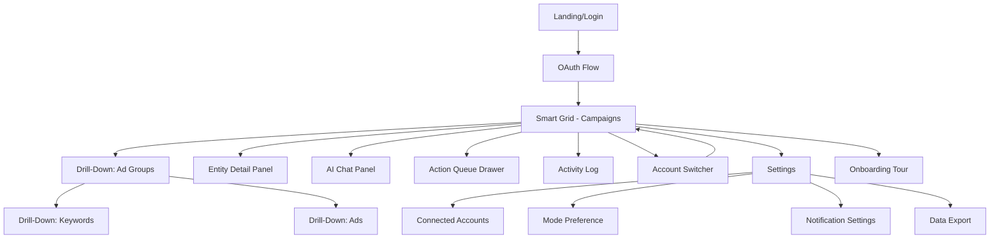
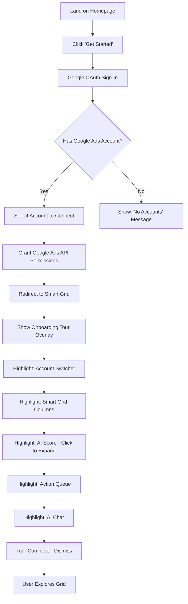
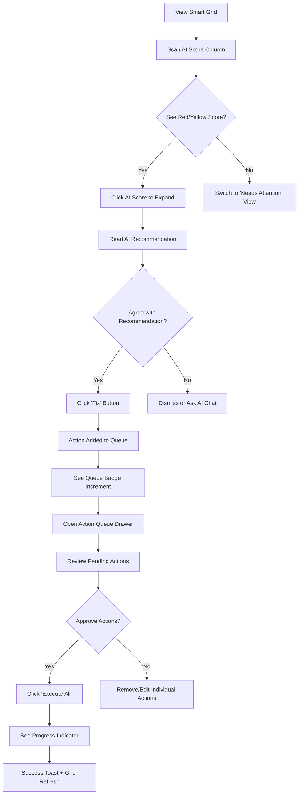
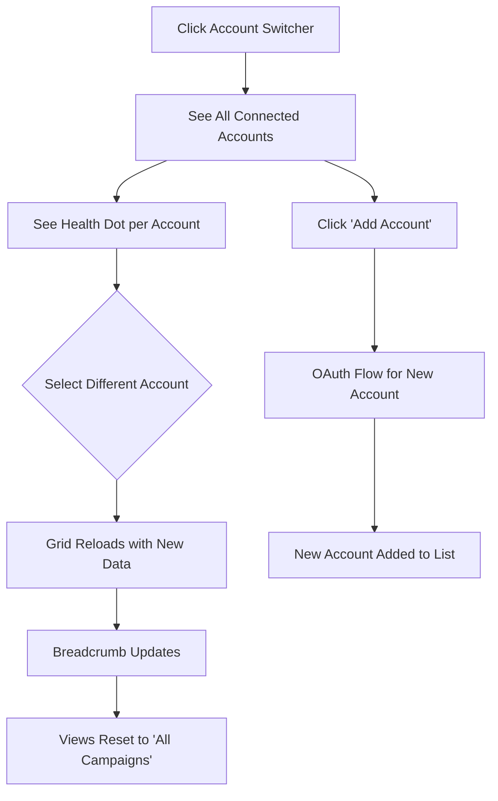
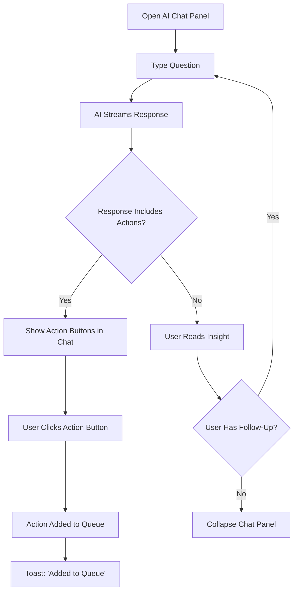
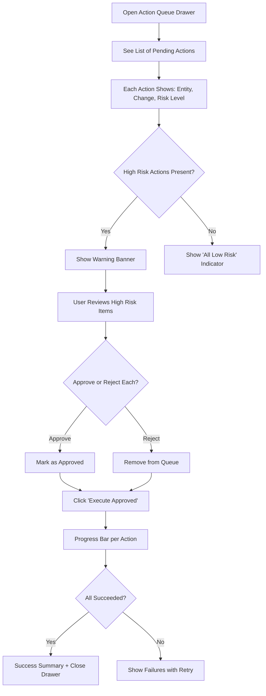

# AI-Powered Google Ads Manager — UI/UX Specification

This document defines the user experience goals, information architecture, user flows, and visual design specifications for the AI-Powered Google Ads Manager's user interface. It serves as the foundation for visual design and frontend development, ensuring a cohesive and user-centered experience.

---

## 1. Introduction

### 1.1 Overall UX Goals & Principles

#### Target User Personas

| Persona | Description | Primary Goals | Pain Points |
|---------|-------------|---------------|-------------|
| **SMB Owner (Primary)** | Business owner spending $1K-$50K/month on Google Ads, moderate technical comfort, beginner-intermediate PPC experience | Get more customers, spend less time managing ads (<1hr/week), understand what's working | "I know I'm wasting money but don't know where", "Google's interface is overwhelming" |
| **Marketing Generalist (Secondary)** | In-house marketer managing Google Ads alongside other channels, intermediate PPC knowledge | Improve PPC without becoming full-time PPC manager, automate reporting | "I'm spread too thin", "I can't justify hiring a PPC specialist" |
| **Agency Power User (Tertiary)** | PPC specialist managing 5-50 accounts, advanced expertise but time-limited | Manage more clients without more headcount, ensure consistent quality | "Audits take 4-8 hours per account", "I spend more time on reporting than optimizing" |

#### Usability Goals

1. **Ease of Learning:** New users can connect an account and understand their performance within 5 minutes
2. **Efficiency of Use:** Power users can review and act on 10+ campaigns in under 2 minutes using the Smart Grid
3. **Error Prevention:** All write operations go through Action Queue with guardrails preventing catastrophic changes
4. **Memorability:** Saved Views and consistent patterns allow infrequent users to return without relearning
5. **30-Second Decisions:** Surface the most critical info (AI Score, Top Issue) so users can act immediately

#### Design Principles

1. **Data-First, Not Dashboard-First** — Users came for their data; show the Smart Grid immediately, not vanity metrics
2. **Progressive Disclosure** — Simple Mode shows essentials; Pro Mode reveals advanced controls on demand
3. **Safety by Design** — Action Queue prevents accidents; guardrails enforce best practices; undo is always available
4. **Consistent Patterns** — Filtering, sorting, and actions work identically across all entity types (Campaigns, Ad Groups, Keywords)
5. **AI as Advisor, Human as Decider** — AI suggests and explains; user reviews and executes; never autonomous

### 1.2 Change Log

| Date | Version | Description | Author |
|------|---------|-------------|--------|
| 2024-12-14 | 1.0 | Initial UI/UX Specification based on PRD v2.0 | UX Expert Agent |

---

## 2. Information Architecture (IA)

### 2.1 Site Map / Screen Inventory



### 2.2 Navigation Structure

**Primary Navigation (Header Bar):**
- Logo (home → Smart Grid)
- Account Switcher dropdown (left side)
- Entity Type selector: Campaigns | Ad Groups | Keywords | Ads (center)
- Mode Toggle: Simple / Pro (right side)
- Action Queue badge with count (right side)
- AI Chat toggle (right side)
- User Menu: Profile, Settings, Sign Out (right side)

**Secondary Navigation (Grid Toolbar):**
- View Tabs: All | Needs Attention | Wasted Spend | Top Performers | Custom Views
- Filter button → Filter panel
- Date Range selector
- Refresh button with last sync timestamp
- Export button (Pro Mode only)

**Breadcrumb Strategy:**
- Appears when drilling down: `Account Name > Campaign Name > Ad Group Name`
- Each segment is clickable to navigate back
- Current level is bold/non-clickable

**Contextual Navigation:**
- Entity Detail Panel: Slide-out from right on row expand
- AI Chat Panel: Collapsible from right edge
- Action Queue: Drawer from right, triggered by badge click

---

## 3. User Flows

### 3.1 First-Time User Onboarding

**User Goal:** Connect first Google Ads account and understand account health

**Entry Points:** Landing page, marketing site CTA

**Success Criteria:** User sees their campaign data in Smart Grid with AI Scores



**Edge Cases & Error Handling:**
- OAuth fails → Show error with retry button
- No Google Ads accounts → Show helpful message with link to create one
- API rate limit during initial sync → Show partial data with "Loading more..." indicator
- User closes tour early → Can restart from Settings

**Notes:** Onboarding tour uses a spotlight/tooltip pattern, not modal interruptions. User can skip at any time.

---

### 3.2 Review and Optimize Campaigns (Core Loop)

**User Goal:** Identify problems, understand recommendations, take action

**Entry Points:** Smart Grid (default view)

**Success Criteria:** User executes at least one optimization from AI recommendations



**Edge Cases & Error Handling:**
- All campaigns have high AI Scores → Show "Your account looks healthy!" message
- Action execution fails → Show error per action, allow retry
- Google Ads API rate limit → Queue actions for later, show countdown

**Notes:** The core loop should take <30 seconds for a single optimization. Bulk operations (select 10, pause all) should take <1 minute.

---

### 3.3 Multi-Account Workflow

**User Goal:** Check status of multiple accounts, switch context

**Entry Points:** Account Switcher dropdown

**Success Criteria:** User can switch accounts in <1 second and see that account's data



**Edge Cases & Error Handling:**
- Account OAuth token expired → Show "Reconnect" button inline
- Account disconnected externally → Show "Account Unavailable" with reconnect option
- 50+ accounts (agency) → Show search/filter in dropdown

**Notes:** Account health dot is calculated from aggregate AI Score: Green (avg >70), Yellow (40-70), Red (<40).

---

### 3.4 AI Chat Interaction

**User Goal:** Ask complex questions, get strategic recommendations

**Entry Points:** AI Chat toggle in header, "Ask AI" buttons in grid

**Success Criteria:** AI provides actionable answer with data from user's account



**Edge Cases & Error Handling:**
- AI response fails → Show retry button
- User asks about disconnected account → AI explains and suggests reconnecting
- Long response → Show "Stop Generating" button
- Network interruption → Resume stream when reconnected

**Notes:** Chat context includes current account summary. If user switches accounts, chat clears with option to "Keep conversation."

---

### 3.5 Action Queue Approval Flow

**User Goal:** Review and execute pending changes safely

**Entry Points:** Action Queue badge, "Review Queue" button after adding actions

**Success Criteria:** User understands each action's impact and executes confidently



**Edge Cases & Error Handling:**
- Guardrail triggered (e.g., pause all campaigns) → Block with explanation
- Partial failure → Show which succeeded/failed, allow retry on failures
- User navigates away with pending actions → Queue persists, badge remains

**Notes:** Risk levels: Low (green) = pause single entity, budget <20% change. Medium (yellow) = budget 20-50% change. High (red) = budget >50%, pause multiple campaigns.

---

## 4. Wireframes & Key Screen Layouts

### 4.1 Design Files

**Primary Design Files:** To be created in Figma
**Design System:** Custom based on Tailwind CSS + shadcn/ui components

### 4.2 Key Screen Layouts

#### 4.2.1 Smart Grid (Primary Screen)

**Purpose:** Main working surface where users view, filter, and act on their Google Ads entities

**Layout Structure:**
```
┌─────────────────────────────────────────────────────────────────────────────┐
│ HEADER                                                                       │
│ [Logo] [Account▼] [Campaigns|AdGroups|Keywords|Ads] [Simple/Pro] [Queue:3] [Chat] [User▼] │
├─────────────────────────────────────────────────────────────────────────────┤
│ TOOLBAR                                                                      │
│ [All] [Needs Attention] [Wasted Spend] [Top Performers] [+View]  [Filter] [Date▼] [↻ 2min ago] │
├─────────────────────────────────────────────────────────────────────────────┤
│ BREADCRUMB (when drilling down)                                              │
│ Account Name > Campaign Name > Ad Group Name                                 │
├─────────────────────────────────────────────────────────────────────────────┤
│ GRID                                                                         │
│ ┌────┬────────────────────┬────────┬────────┬────────┬───────┬───────┬─────────┬─────────┐ │
│ │ □  │ Name               │ Status │ Type   │ Spend  │ Conv  │ CPA   │AI Score │ Action  │ │
│ ├────┼────────────────────┼────────┼────────┼────────┼───────┼───────┼─────────┼─────────┤ │
│ │ □  │ Brand Keywords     │ ●On    │ Search │ $1,234 │ 45    │ $27   │ 92 🟢   │ [···]   │ │
│ │ □  │ Competitor Terms   │ ●On    │ Search │ $2,100 │ 12    │ $175  │ 34 🔴   │ [Fix]   │ │
│ │ □  │ PMax - Products    │ ●On    │ PMax   │ $5,600 │ 89    │ $63   │ 78 🟡   │ [···]   │ │
│ └────┴────────────────────┴────────┴────────┴────────┴───────┴───────┴─────────┴─────────┘ │
├─────────────────────────────────────────────────────────────────────────────┤
│ FOOTER                                                                       │
│ [Bulk Actions▼] Selected: 0  │  Showing 1-25 of 47  │  Total: $12,134 spent  │
└─────────────────────────────────────────────────────────────────────────────┘
```

**Key Elements:**
- Checkbox column for multi-select
- Sortable column headers (click to sort)
- Status indicator with color dot (green=active, gray=paused)
- Type badge with icon (Search, PMax, Shopping, etc.)
- AI Score with color coding and expandable detail
- Action column: "Fix" button when recommendation exists, "···" menu otherwise

**Interaction Notes:**
- Click row → Drill down to children (campaigns → ad groups)
- Click expand icon → Open Entity Detail Panel
- Hover AI Score → Show tooltip with top issue summary
- Click AI Score → Expand inline to show full recommendations
- Double-click cell → Inline edit (budget, status)

**Simple Mode vs Pro Mode:**

| Column | Simple Mode | Pro Mode |
|--------|-------------|----------|
| Name | ✓ | ✓ |
| Status | ✓ | ✓ |
| Type | ✓ | ✓ |
| Spend | ✓ | ✓ |
| Clicks | - | ✓ |
| Impressions | - | ✓ |
| CTR | - | ✓ |
| Conversions | ✓ | ✓ |
| CPA | ✓ | ✓ |
| ROAS | - | ✓ |
| Quality Score | - | ✓ (Search only) |
| Impression Share | - | ✓ |
| AI Score | ✓ (prominent) | ✓ |
| Top Issue | ✓ | - (shown in AI Score) |
| Action | ✓ (Fix button) | ✓ (full menu) |

---

#### 4.2.2 Entity Detail Panel (Slide-Out)

**Purpose:** Show comprehensive details for a single entity without leaving grid context

**Layout Structure:**
```
┌─────────────────────────────────────┐
│ PANEL HEADER                        │
│ [← Back] Campaign: Brand Keywords   │ [Pin] [×]
├─────────────────────────────────────┤
│ STATUS BAR                          │
│ ●Active  │  Search  │  AI: 92 🟢    │
├─────────────────────────────────────┤
│ QUICK ACTIONS                       │
│ [Pause] [Edit Budget: $50/day] [···]│
├─────────────────────────────────────┤
│ METRICS SUMMARY                     │
│ ┌─────────┬─────────┬─────────┐    │
│ │ Spend   │ Conv    │ CPA     │    │
│ │ $1,234  │ 45      │ $27     │    │
│ │ ▲12%    │ ▲8%     │ ▼3%     │    │
│ └─────────┴─────────┴─────────┘    │
├─────────────────────────────────────┤
│ AI RECOMMENDATIONS                  │
│ ┌─────────────────────────────────┐ │
│ │ 🟡 Consider adding negative     │ │
│ │    keywords for "free" searches │ │
│ │    Est. savings: $120/month     │ │
│ │    [Add Negatives] [Dismiss]    │ │
│ └─────────────────────────────────┘ │
│ ┌─────────────────────────────────┐ │
│ │ 🟢 Top performing ad group:     │ │
│ │    "Exact Match" - 45% of conv  │ │
│ │    [Increase Budget] [View]     │ │
│ └─────────────────────────────────┘ │
├─────────────────────────────────────┤
│ PERFORMANCE CHART                   │
│ [7D] [30D] [90D]                    │
│ ┌─────────────────────────────────┐ │
│ │     📈 Spend/Conv over time     │ │
│ └─────────────────────────────────┘ │
├─────────────────────────────────────┤
│ CHILDREN (Ad Groups)                │
│ • Exact Match (12 keywords) →       │
│ • Phrase Match (8 keywords) →       │
│ • Broad Match (5 keywords) →        │
└─────────────────────────────────────┘
```

**Key Elements:**
- Pinnable panel (stays open while navigating grid)
- Quick action buttons for common operations
- Trend indicators (▲▼) comparing to previous period
- AI recommendations with action buttons
- Mini performance chart
- Children list for drill-down

**Interaction Notes:**
- Actions go to Action Queue (not immediate)
- Chart is interactive (hover for values)
- Children list is clickable for drill-down

---

#### 4.2.3 AI Chat Panel

**Purpose:** Natural language interface for complex questions and strategic advice

**Layout Structure:**
```
┌─────────────────────────────────────┐
│ CHAT HEADER                         │
│ AI Assistant          [Clear] [×]   │
├─────────────────────────────────────┤
│ CONTEXT INDICATOR                   │
│ 📊 Using data from: Acme Corp       │
│    Last updated: 2 min ago          │
├─────────────────────────────────────┤
│ CHAT MESSAGES                       │
│                                     │
│ ┌─────────────────────────────────┐ │
│ │ 👤 What's wasting money in my   │ │
│ │    account?                     │ │
│ └─────────────────────────────────┘ │
│                                     │
│ ┌─────────────────────────────────┐ │
│ │ 🤖 I found 3 areas of waste:    │ │
│ │                                 │ │
│ │ 1. **Competitor Terms** has     │ │
│ │    spent $2,100 with only 12    │ │
│ │    conversions ($175 CPA vs     │ │
│ │    your average of $45)         │ │
│ │    [Pause Campaign]             │ │
│ │                                 │ │
│ │ 2. Search term "free stuff"     │ │
│ │    has 234 clicks, 0 conv       │ │
│ │    [Add as Negative]            │ │
│ │                                 │ │
│ │ 3. Mobile CPA is 2x desktop     │ │
│ │    [View Device Report]         │ │
│ └─────────────────────────────────┘ │
│                                     │
├─────────────────────────────────────┤
│ INPUT                               │
│ ┌─────────────────────────────────┐ │
│ │ Ask about your account...    [→]│ │
│ └─────────────────────────────────┘ │
│ [Stop] when generating              │
└─────────────────────────────────────┘
```

**Key Elements:**
- Context indicator showing which account data is loaded
- User messages right-aligned, AI left-aligned
- Action buttons embedded in AI responses
- Streaming text with typing indicator
- Clear history button

**Interaction Notes:**
- Action buttons add to Action Queue with toast confirmation
- Panel resizable (drag left edge)
- Collapses to icon when closed
- Keyboard shortcut: Cmd/Ctrl + K to open

---

#### 4.2.4 Action Queue Drawer

**Purpose:** Review, approve, and execute pending changes safely

**Layout Structure:**
```
┌─────────────────────────────────────┐
│ DRAWER HEADER                       │
│ Action Queue (5 pending)       [×]  │
├─────────────────────────────────────┤
│ WARNING BANNER (if high risk)       │
│ ⚠️ 2 high-risk actions require      │
│    your attention                   │
├─────────────────────────────────────┤
│ ACTIONS LIST                        │
│                                     │
│ ┌─────────────────────────────────┐ │
│ │ 🔴 HIGH RISK                    │ │
│ │ Pause Campaign: Competitor Terms│ │
│ │ Current: Active → Paused        │ │
│ │ Impact: Stops $70/day spend     │ │
│ │ [Approve] [Remove]              │ │
│ └─────────────────────────────────┘ │
│                                     │
│ ┌─────────────────────────────────┐ │
│ │ 🟡 MEDIUM RISK                  │ │
│ │ Adjust Budget: Brand Keywords   │ │
│ │ Current: $50/day → $75/day      │ │
│ │ Change: +50%                    │ │
│ │ [Approve] [Edit] [Remove]       │ │
│ └─────────────────────────────────┘ │
│                                     │
│ ┌─────────────────────────────────┐ │
│ │ 🟢 LOW RISK                     │ │
│ │ Add Negative: "free stuff"      │ │
│ │ To: Brand Keywords (Campaign)   │ │
│ │ Match Type: Phrase              │ │
│ │ [Approve] [Remove]              │ │
│ └─────────────────────────────────┘ │
│                                     │
├─────────────────────────────────────┤
│ DRAWER FOOTER                       │
│ [Clear All]  [Execute 5 Actions]    │
│              ↳ 3 approved, 2 pending│
└─────────────────────────────────────┘
```

**Key Elements:**
- Risk level color coding with icons
- Clear description of each change (before → after)
- Impact statement for significant changes
- Individual approve/remove buttons
- Bulk execute button with count

**Interaction Notes:**
- High-risk actions require explicit approval before execute
- Edit opens inline form for adjusting values
- Execute shows progress per action
- Success/failure feedback per action

---

#### 4.2.5 Account Switcher Dropdown

**Purpose:** Quick navigation between connected Google Ads accounts

**Layout Structure:**
```
┌─────────────────────────────────────┐
│ Current: Acme Corp             [▼]  │
└─────────────────────────────────────┘
        │
        ▼
┌─────────────────────────────────────┐
│ 🔍 Search accounts...               │
├─────────────────────────────────────┤
│ ● Acme Corp (123-456-7890)    🟢 92│
│   $12,134 spent this month          │
├─────────────────────────────────────┤
│ ○ Beta LLC (234-567-8901)     🟡 68│
│   $5,200 spent this month           │
├─────────────────────────────────────┤
│ ○ Gamma Inc (345-678-9012)    🔴 34│
│   $8,900 spent this month           │
├─────────────────────────────────────┤
│ ○ Delta Co (456-789-0123)     ⚠️   │
│   ⚠️ Reconnect required             │
├─────────────────────────────────────┤
│ [+ Add Another Account]             │
└─────────────────────────────────────┘
```

**Key Elements:**
- Search/filter for agencies with many accounts
- Health score per account (aggregate AI Score)
- Monthly spend indicator
- Reconnect warning for expired OAuth
- Add account button

**Interaction Notes:**
- Click account → Grid reloads with that account's data
- Click reconnect → OAuth flow
- Keyboard navigable (arrow keys, enter)

---

#### 4.2.6 Mobile Card View

**Purpose:** Mobile-friendly view of campaign data when grid doesn't fit

**Layout Structure:**
```
┌─────────────────────────────────────┐
│ MOBILE HEADER                       │
│ [☰] Acme Corp [Queue:3] [Chat]      │
├─────────────────────────────────────┤
│ VIEW TABS (horizontal scroll)       │
│ [All] [Attention] [Wasted] [Top]    │
├─────────────────────────────────────┤
│ CAMPAIGN CARDS                      │
│                                     │
│ ┌─────────────────────────────────┐ │
│ │ Brand Keywords           🟢 92  │ │
│ │ Search • Active                 │ │
│ │ ─────────────────────────────── │ │
│ │ Spend      Conv       CPA       │ │
│ │ $1,234     45         $27       │ │
│ │ ─────────────────────────────── │ │
│ │ [Pause] [Details →]             │ │
│ └─────────────────────────────────┘ │
│                                     │
│ ┌─────────────────────────────────┐ │
│ │ Competitor Terms         🔴 34  │ │
│ │ Search • Active                 │ │
│ │ ─────────────────────────────── │ │
│ │ ⚠️ High CPA: $175 (avg: $45)    │ │
│ │ ─────────────────────────────── │ │
│ │ [Fix: Pause] [Details →]        │ │
│ └─────────────────────────────────┘ │
│                                     │
└─────────────────────────────────────┘
```

**Key Elements:**
- Hamburger menu for navigation
- Horizontal scrolling view tabs
- Card-based layout (one campaign per card)
- AI Score prominent with issue callout
- Quick action buttons on each card

**Interaction Notes:**
- Swipe left on card for more actions
- Tap card to expand details (accordion)
- Pull to refresh
- Chat opens as full-screen modal

---

## 5. Component Library / Design System

### 5.1 Design System Approach

**Foundation:** Tailwind CSS utility classes with shadcn/ui component primitives
**Customization:** Extended with Google Ads-specific components
**Documentation:** Storybook for component documentation and testing

### 5.2 Core Components

#### Data Grid

**Purpose:** Primary data display component for Smart Grid

**Variants:**
- Default (full-featured with all interactions)
- Compact (reduced row height for Pro Mode)
- Card View (mobile alternative)

**States:**
- Loading (skeleton rows)
- Empty (no data message)
- Error (retry prompt)
- Selecting (checkbox mode active)

**Usage Guidelines:**
- Always include at least Name, Status, and one metric column
- AI Score column should be sortable
- Actions column should be pinned right

#### Entity Card

**Purpose:** Mobile-friendly representation of a campaign/ad group/keyword

**Variants:**
- Campaign Card
- Ad Group Card
- Keyword Card
- Ad Card

**States:**
- Default
- Expanded (showing more metrics)
- Selected (bulk action mode)
- Warning (has issue)

**Usage Guidelines:**
- Always show AI Score and Status
- Show primary issue callout when AI Score < 50
- Quick action buttons should be most common actions

#### AI Score Badge

**Purpose:** Visual indicator of entity health with expandable details

**Variants:**
- Compact (number + color only)
- Expanded (with breakdown)
- Inline (for tooltips)

**States:**
- Green (70-100): Healthy
- Yellow (40-69): Needs attention
- Red (0-39): Critical
- Gray: No data / calculating

**Usage Guidelines:**
- Always show numeric score, not just color
- Tooltip should show top issue on hover
- Click should expand to full recommendation

#### Action Button

**Purpose:** Trigger actions that go to Action Queue

**Variants:**
- Primary (recommended action)
- Secondary (alternative action)
- Danger (destructive action)
- Ghost (subtle/inline)

**States:**
- Default
- Hover
- Loading (action being added)
- Completed (action in queue)
- Disabled

**Usage Guidelines:**
- Primary for AI-recommended actions
- Danger for pause/disable actions
- Always show confirmation that action was queued

#### Risk Badge

**Purpose:** Indicate risk level of pending actions

**Variants:**
- Low Risk (green)
- Medium Risk (yellow)
- High Risk (red)

**States:**
- Default
- Highlighted (needs attention)

**Usage Guidelines:**
- Always pair with explanation of why it's that risk level
- High risk should block execution until approved

#### Chat Message

**Purpose:** Display user and AI messages in chat panel

**Variants:**
- User Message (right-aligned)
- AI Message (left-aligned)
- System Message (centered, subtle)
- Action Message (with embedded buttons)

**States:**
- Default
- Streaming (typing indicator)
- Error (with retry)

**Usage Guidelines:**
- AI messages should use markdown formatting
- Action buttons should be clearly labeled
- Streaming should show partial text

---

## 6. Branding & Style Guide

### 6.1 Visual Identity

**Brand Guidelines:** Modern, professional, trustworthy. Think "friendly expert" not "intimidating dashboard."

### 6.2 Color Palette

| Color Type | Hex Code | Usage |
|------------|----------|-------|
| Primary | `#2563EB` (Blue 600) | Primary actions, links, focus states |
| Primary Dark | `#1D4ED8` (Blue 700) | Hover states, active states |
| Secondary | `#6366F1` (Indigo 500) | AI-related elements, chat accents |
| Accent | `#8B5CF6` (Violet 500) | Pro Mode indicators, premium features |
| Success | `#10B981` (Emerald 500) | Positive metrics, healthy AI scores, confirmations |
| Warning | `#F59E0B` (Amber 500) | Cautions, medium risk, needs attention |
| Error | `#EF4444` (Red 500) | Errors, high risk, critical issues |
| Neutral 50 | `#F9FAFB` | Page background |
| Neutral 100 | `#F3F4F6` | Card backgrounds, hover states |
| Neutral 200 | `#E5E7EB` | Borders, dividers |
| Neutral 500 | `#6B7280` | Secondary text |
| Neutral 900 | `#111827` | Primary text |

### 6.3 Typography

#### Font Families

- **Primary:** Inter (clean, readable, excellent for data)
- **Secondary:** Inter (same family for consistency)
- **Monospace:** JetBrains Mono (for numbers, IDs, code)

#### Type Scale

| Element | Size | Weight | Line Height |
|---------|------|--------|-------------|
| H1 | 30px / 1.875rem | 700 (Bold) | 1.2 |
| H2 | 24px / 1.5rem | 600 (Semibold) | 1.25 |
| H3 | 20px / 1.25rem | 600 (Semibold) | 1.3 |
| H4 | 16px / 1rem | 600 (Semibold) | 1.4 |
| Body | 14px / 0.875rem | 400 (Regular) | 1.5 |
| Body Small | 13px / 0.8125rem | 400 (Regular) | 1.5 |
| Caption | 12px / 0.75rem | 400 (Regular) | 1.4 |
| Mono/Data | 13px / 0.8125rem | 500 (Medium) | 1.4 |

### 6.4 Iconography

**Icon Library:** Lucide Icons (MIT license, consistent style, good coverage)

**Usage Guidelines:**
- 16px for inline icons
- 20px for button icons
- 24px for navigation icons
- Always pair icons with text labels (accessibility)
- Use filled variants for active states, outline for inactive

**Key Icons:**
- Campaigns: `target`
- Ad Groups: `layers`
- Keywords: `key`
- Ads: `megaphone`
- Search: `search`
- PMax: `zap`
- Shopping: `shopping-cart`
- Display: `image`
- Video: `video`
- AI Chat: `message-circle`
- Action Queue: `list-checks`
- Settings: `settings`
- Refresh: `refresh-cw`
- Filter: `filter`
- Sort: `arrow-up-down`

### 6.5 Spacing & Layout

**Grid System:** 12-column grid with 24px gutters

**Spacing Scale (Tailwind):**
| Name | Value | Usage |
|------|-------|-------|
| xs | 4px | Inline icon spacing |
| sm | 8px | Tight component spacing |
| md | 16px | Default component spacing |
| lg | 24px | Section spacing |
| xl | 32px | Major section spacing |
| 2xl | 48px | Page-level spacing |

**Container Widths:**
- Max content width: 1440px
- Grid area: 100% - sidebar (if any)
- Detail panel: 400px fixed
- Chat panel: 360px default, resizable to 480px

---

## 7. Accessibility Requirements

### 7.1 Compliance Target

**Standard:** WCAG 2.1 Level AA

### 7.2 Key Requirements

**Visual:**
- Color contrast ratios: 4.5:1 minimum for text, 3:1 for large text and UI components
- Focus indicators: 2px solid ring with 2px offset, using primary color
- Text sizing: Base 14px, user-scalable up to 200% without horizontal scroll

**Interaction:**
- Keyboard navigation: Full grid navigation with arrow keys, Tab for focus movement, Enter/Space for actions
- Screen reader support: Proper ARIA labels, live regions for dynamic content, role announcements
- Touch targets: Minimum 44x44px for all interactive elements on touch devices

**Content:**
- Alternative text: All icons have aria-label, charts have text descriptions
- Heading structure: Proper H1-H6 hierarchy, single H1 per page
- Form labels: All inputs have visible labels, required fields marked

### 7.3 Testing Strategy

1. **Automated:** axe-core integration in CI/CD, Lighthouse accessibility audits
2. **Manual:** Keyboard-only testing for all flows, screen reader testing (VoiceOver, NVDA)
3. **User Testing:** Include users with disabilities in beta testing

---

## 8. Responsiveness Strategy

### 8.1 Breakpoints

| Breakpoint | Min Width | Max Width | Target Devices |
|------------|-----------|-----------|----------------|
| Mobile | 320px | 767px | Phones (portrait) |
| Tablet | 768px | 1023px | Tablets, phones (landscape) |
| Desktop | 1024px | 1439px | Laptops, small monitors |
| Wide | 1440px | - | Large monitors, external displays |

### 8.2 Adaptation Patterns

**Layout Changes:**
- Mobile: Single column, card-based layout, bottom navigation
- Tablet: Two-column where appropriate, collapsible panels
- Desktop: Full Smart Grid with optional side panels
- Wide: Extended grid columns, persistent side panels

**Navigation Changes:**
- Mobile: Hamburger menu, bottom tab bar for primary actions
- Tablet: Collapsed sidebar, top header
- Desktop+: Full header with all controls visible

**Content Priority:**
- Mobile: AI Score, Status, Name, and one key metric; details on tap
- Tablet: Add more columns, still card-friendly
- Desktop: Full column set in Simple Mode
- Wide: All columns visible in Pro Mode

**Interaction Changes:**
- Mobile: Tap to expand, swipe for actions, pull to refresh
- Tablet: Tap or hover, panels slide over content
- Desktop: Hover states, panels slide alongside content
- All: Touch targets ≥44px on touch devices

---

## 9. Animation & Micro-interactions

### 9.1 Motion Principles

1. **Purposeful:** Animations guide attention and provide feedback, never just decoration
2. **Quick:** Most transitions under 200ms; never make users wait
3. **Subtle:** Prefer opacity and transform over dramatic movement
4. **Respectful:** Honor prefers-reduced-motion media query

### 9.2 Key Animations

| Animation | Description | Duration | Easing |
|-----------|-------------|----------|--------|
| Panel Slide | Detail/Chat panel slides in from right | 200ms | ease-out |
| Drawer Open | Action Queue drawer slides up from bottom (mobile) or right (desktop) | 200ms | ease-out |
| Row Expand | Grid row expands to show inline recommendations | 150ms | ease-out |
| Toast Enter | Toast notification slides in from top-right | 150ms | ease-out |
| Toast Exit | Toast fades out | 100ms | ease-in |
| Button Press | Scale down slightly on press | 50ms | ease-in-out |
| Loading Skeleton | Shimmer effect on loading placeholders | 1500ms | linear (loop) |
| AI Typing | Pulsing dots indicator | 600ms | ease-in-out (loop) |
| Success Check | Checkmark draws in | 300ms | ease-out |
| Risk Badge Pulse | Attention pulse on high-risk items | 1000ms | ease-in-out (2x) |

---

## 10. Performance Considerations

### 10.1 Performance Goals

| Metric | Target |
|--------|--------|
| Page Load (LCP) | < 2.5 seconds |
| Interaction Response (FID) | < 100ms |
| Layout Stability (CLS) | < 0.1 |
| Animation FPS | 60fps |
| Grid Scroll (1000 rows) | 60fps with virtualization |

### 10.2 Design Strategies

1. **Skeleton Loading:** Show layout immediately with content placeholders
2. **Virtual Scrolling:** Only render visible grid rows (TanStack Virtual)
3. **Optimistic Updates:** Update UI immediately, sync with server async
4. **Progressive Enhancement:** Core functionality works without JS for initial render
5. **Image Optimization:** WebP format, lazy loading, responsive srcset
6. **Code Splitting:** Load panel components on demand
7. **Caching:** Aggressive caching with stale-while-revalidate for API data

---

## 11. Next Steps

### 11.1 Immediate Actions

1. Create high-fidelity mockups in Figma for Smart Grid (desktop and mobile)
2. Build component library in Storybook with all variants and states
3. Implement responsive prototype for user testing
4. Conduct usability testing with 3-5 target users
5. Iterate on designs based on testing feedback
6. Prepare design handoff documentation for developers

### 11.2 Design Handoff Checklist

- [x] All user flows documented
- [x] Component inventory complete
- [x] Accessibility requirements defined
- [x] Responsive strategy clear
- [x] Brand guidelines incorporated
- [x] Performance goals established
- [ ] High-fidelity mockups created (Figma)
- [ ] Interactive prototype built
- [ ] User testing completed
- [ ] Developer handoff specs finalized

---

## 12. Appendix: AI UI Generation Prompts

### 12.1 v0.dev Prompt for Smart Grid

```
Create a data grid component for a Google Ads management application with the following specifications:

Layout:
- Full-width responsive table/grid
- Sticky header row
- Checkbox column for multi-select
- Sortable column headers

Columns:
- Checkbox (selection)
- Campaign Name (text, primary)
- Status (badge: Active=green dot, Paused=gray dot)
- Type (badge: Search, PMax, Shopping, Display, Video)
- Spend (currency, right-aligned, monospace)
- Conversions (number, right-aligned)
- CPA (currency, right-aligned)
- AI Score (0-100 with color: green >70, yellow 40-70, red <40)
- Actions (dropdown menu button)

Features:
- Row hover state with subtle background change
- Click row to select or drill down
- AI Score column should show a colored badge with the number
- Actions column has a "..." button that opens a dropdown

Style:
- Clean, modern design using Tailwind CSS
- Use Inter font
- Neutral colors for structure, blue for primary actions
- Cards have subtle shadows and rounded corners

Include a toolbar above the grid with:
- View tabs (All, Needs Attention, Wasted Spend, Top Performers)
- Filter button
- Date range dropdown
- Refresh button with timestamp
```

### 12.2 v0.dev Prompt for Action Queue

```
Create an Action Queue drawer component for a Google Ads management app:

Layout:
- Slide-in drawer from right side (400px width)
- Header with title "Action Queue" and item count badge
- Scrollable list of pending actions
- Sticky footer with action buttons

Each action item shows:
- Risk level badge (Low=green, Medium=yellow, High=red)
- Action title (e.g., "Pause Campaign: Brand Keywords")
- Current value → New value
- Impact statement for high-risk items
- Approve/Remove buttons per item

Footer:
- "Clear All" secondary button
- "Execute (N) Actions" primary button
- Count of approved vs pending

Style:
- Clean design with Tailwind CSS
- Risk badges should be prominently colored
- High-risk items should have a subtle warning background
- Use shadows to separate from main content
```

---

*Generated by BMad Method - UX Expert Agent (Sally)*
